## Add your Project to a Git Remote Repository

In this section we want to add the  Hello World UI5 project to Source Control, commit and push the project and changes to a remote Git repository.

### Step 1: Create a new and empty Github Repository

This step describes how to create a Github repository in which you can store the source code of your project. You need to have a user in a public GitHub to execute the steps below.

> **Warning:**
> 
> Create a **new, fresh and empty repository**. Do not  use an existing repository, which has already commits. 
> Do not create a README.md file or anything else for the new repo (for example, your BAS project already contains a README.md file). 
You would need to merge two commit histories before you can proceed, which you should only do if you are already pretty familiar wit Git. 
And the procedure to do so is not part of this mission.

 

**Procedure**

1. Open your github home page.

2. Click on *New* in the **Repository** tab to create a new repository.

    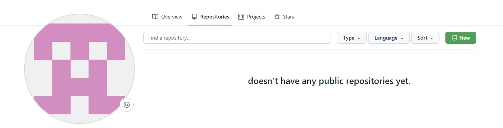
   
 

3. Enter a GitHub organization (can also be your user) and the name of the repository. 
    For example, `Gitorg/btp-helloworld-app`.  
    **Do not check the checkbox Intialize this repository with a README**.

5. Click on create repository. 

    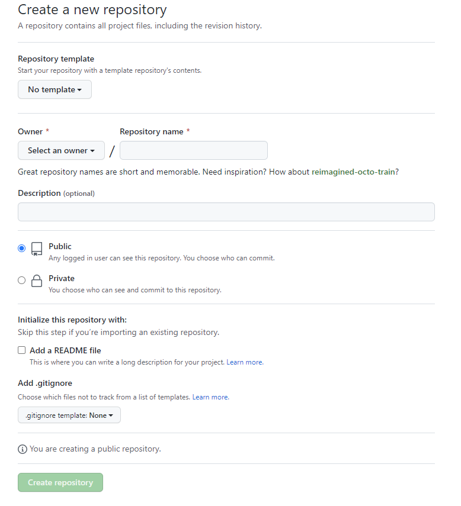

 

5. **Do not create any files.**
   Copy the github url of the newly created Git repository.

    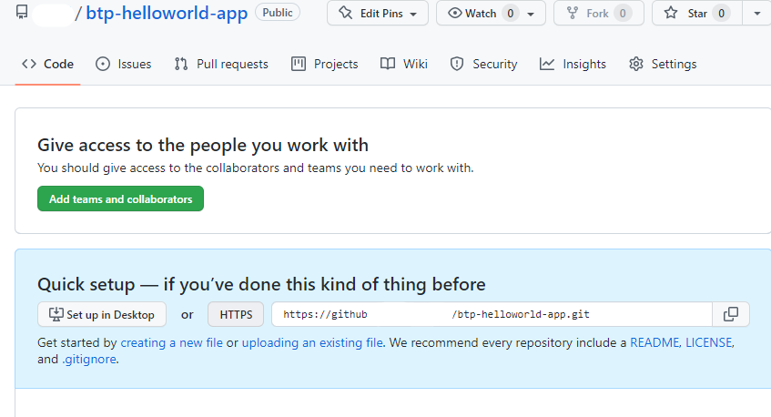

 

### Step 2: Generate a Personal Access Token  

This step might be necessary if your GitHub repository does not accept Git password.
Follow the guidance of your repository. 

E.g. for GitHub the [Creating a personal access token (external link)](https://docs.github.com/en/authentication/keeping-your-account-and-data-secure/creating-a-personal-access-token).

### Step 3: Add a Remote Repository to your HelloWorld Project

In this step you add the remote repository you just created on GitHub to your HelloWorld UI5 Project from the previous section of the mission.

**Procedure**

1. As described in the previous sections of the mission, open your BTP subaccount again.
2. Open the service Business Application Studio again.
3. If your Dev Sapce has stopped, click start to start your dev space again and open your dev space once it has started.
4. Open your workspace or project from folder **/home/user/projects/helloworldui5**. 
5. Navigate in the left-handed pane to **GitLens**.
   you can see, that you did not yet configire a **Remote**
   
   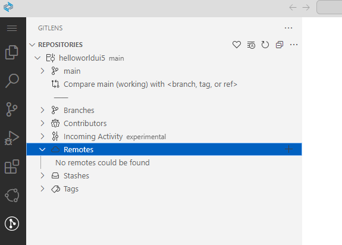
   
    
   
 6. Add a Remote configuration by pressing the **"+" Button**.
    Provide any name for your remote.

   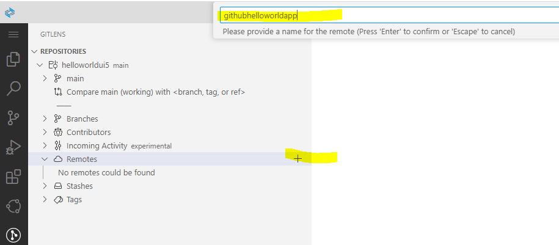

     
 
7. Provide the repository URL of your GitHub Repository

   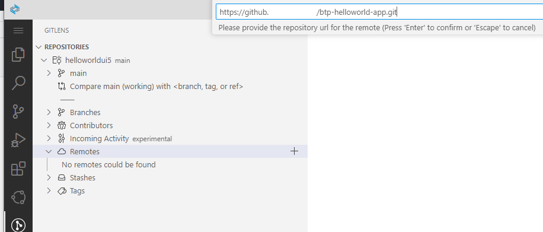

     
    
8. Provide GitHub user name and password (or PAT - personal access token).

   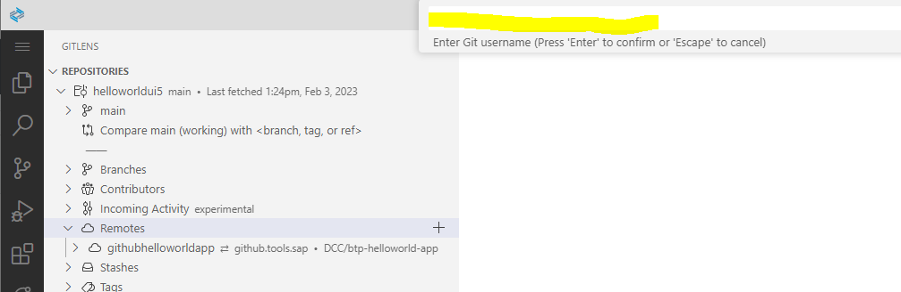
   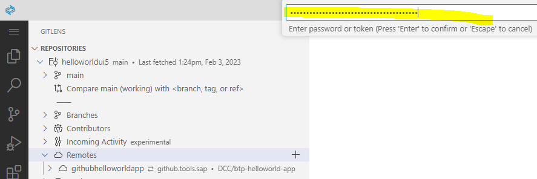

9. Save GitHub credentials for this session or as plaintext in your devspace.

   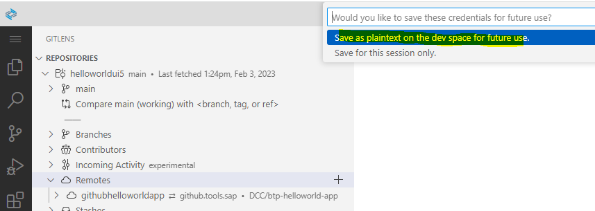

10. Iy you made any mistake, delete your remote definition and repeat. 
    You will have to use terminal, which you can start preconfigured from the context of your remote entry
    
     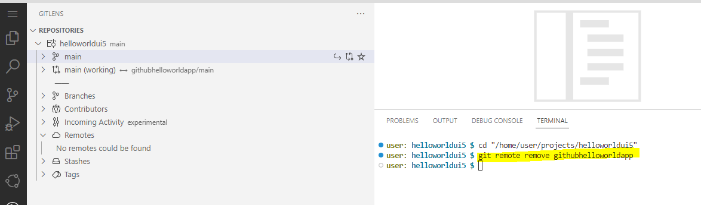
    
11. Check the result of your configuration.
    You see the **hellowordui5** project is now green, means in the status of Git "untracked".
    Your remote repository is still empty.
    
     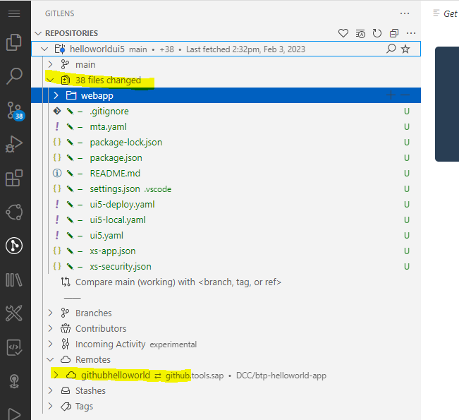

     

12. Next step is to **Commit** your files in Git. 
    Select the icon **"Source Control"** in the left-handed navigation pane.
    Provide a commit text (in this case we typed "initial commit") and press **"Commit"**.
    If you get a warning, that you did not **"stage your changes"** all commits, press **"Yes"** to proceed.
        
    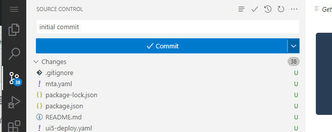
    
    
13. Check your remote repo. It is still empty. 
    The commit updates only the Git status of your local project. 
    To change this, you must **Publish the Branch** to your remote repository.
    To do so, choose "Source Control" again, provide some text and publish your branch. 
    
    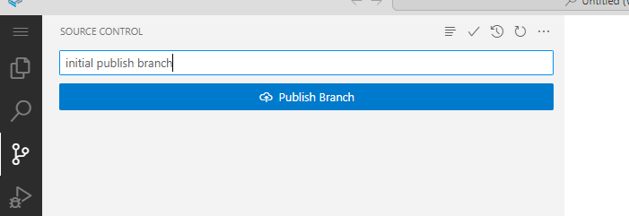
    
     
    
    Naviagte to your remote repo. You will se its now updated.
    
     
