## Create a Hello World Project with Git Source Control

SAP Business Application Studio (BAS) enables you to connect and interact with the **Git source control** system, letting you connect and interact with **remote Git repositories**.
Using SAP Business Application Studio, you can connect to all public git services, such as GitHub, GitLab, and BitBucket.

### Prerequisites

BAS can connect to on premise Git repositories or public Git repositories. Connecting to on premise repositories is not part of this mission (see [Connecting to a Corporate Git Repository]([Connecting to a Corporate Git Repository](https://help.sap.com/docs/SAP%20Business%20Application%20Studio/9d1db9835307451daa8c930fbd9ab264/d54ddfc1bc4f45b19dabfa0950799685.html?locale=en-US)) on SAP Help Portal).

In this mission you will connect to a public GitHub Repository using **basic authentication** with GitHub **Personal Access Token (PAT)**.
You can create a PAT in GitHub following these [instructions (external link)](https://docs.github.com/en/authentication/keeping-your-account-and-data-secure/creating-a-personal-access-token). Other Git providers will have different ways of creating PATs.

**Note:** To work with the Git view in SAP Business Application Studio, you need to store or cache credentials. Doing this requires you to entrust your credentials to SAP and to a third party.

### Clone from Git Repository

The easiest way in BAS to add Git source control to your project and to establish a connection to a remote Git repository is to **Clone a repository from Git**.
in BAS you can do this manually, using a the terminal or u use the BAS wizard.

#### Procedure

1. Have or create an empty repository.
In this case we use a public accessible GitHub repository, and call the repo `btp-helloworld-app`. It just contains a README.md file.

    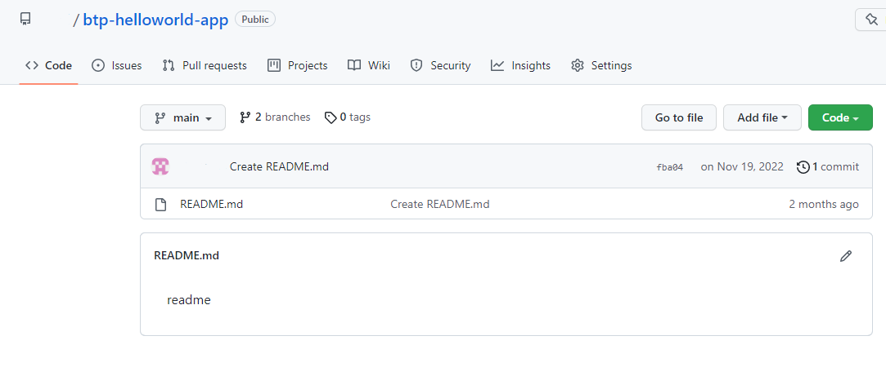

2. Open a the Dev Space in your BAS. You will see the **Get Satrted** home page. 
If not, because you closed it for example, go to the left-handed navigation pane **menue icon** or top **menue bar** (depending on the configuration of your BAS), select **Help** and open **Get Started** again.

    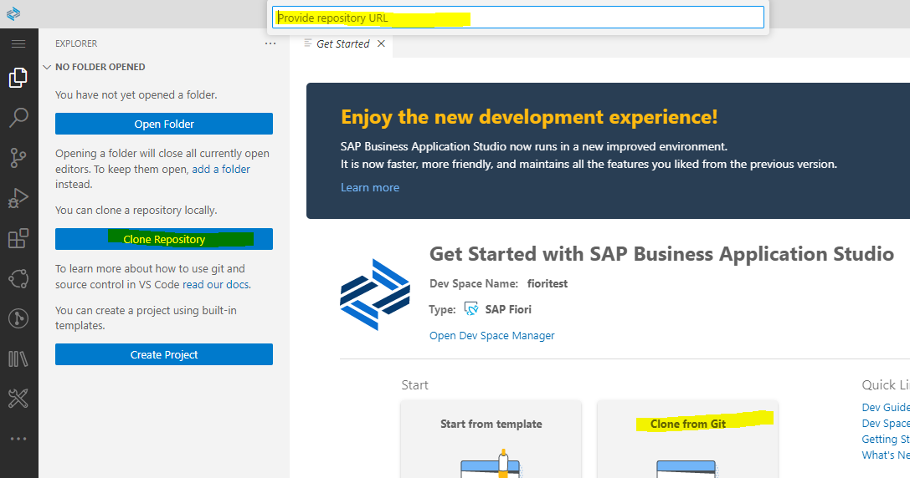

    Select `Clone Repository`or `Clone from Git`.
    Provide the HTTPS repository URL, which you will also find under `Code` in your GitHub repo.

3. Choose a project folder to clone your GitHub repository into.  Typically this is **/home/user/projects**

    

4. Provide your Git username, which has access to the remote Git repository.

   

5. Provide passoword (if possible, not recommended) or PTA token (see "Prerequisites").

   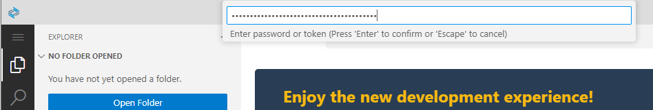

6. Consider to save your settings.

    

7. As a result, you will a Git initialized new project in your workspace. In this case called BTP-HELLOWORLD-APP.
Note, that the footer line is blue and indicates the Git branch you are in: **main**.

    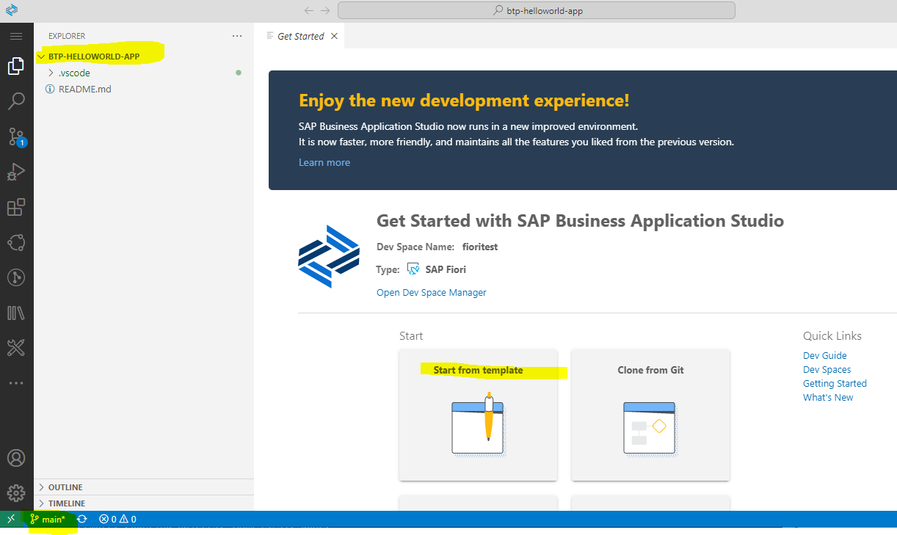
    
    
8. Create a new Fiori/UI5 hello world app from the scratch by clicking **Start from Template**

 
 

### Create an SAP Fiori Application with "Start from template"

Like described in detail in the previous section "Create an SAP Fiori Application with "Start from template"" execute the following steps:

1. Click on Start from template in the "Get Started" tab to create the project. 
Alternative: Open the menu in the top left corner and go to View > Command Palette … and search for ">new project". Select the command SAP Business Application Studio: New Project from Template

2. In the New Project Wizard select SAP Fiori Application.

3. In the Floorplan Selection choose the following: 
For the field Application Type choose SAPUI5 freestyle from the drop-down. 
Select SAPUI5 Application as floorplan.
Choose Next.

4. In the Data Source and Service Selection choose None for Data source, because we just create a "Hello World" without data binding. Choose Next.
5. Under Entity Selection name your SAPUI5 view. This name will appear in the launchpad service for the app. We keep "View1" for now.
6. In the next step, Project Attributes choose names and a description for your "Hello World" app (examples see figure):

    Module name `helloworldgit`  
    Application `title Hello World Git App Title`  
    Application namespace `sap.btp`  
    Description: `A Fiori Git application`  
    **Note:** your project root folder ist now **/home/user/projects/btp-helloworld-app** and we name the module now **helloworldgit**

    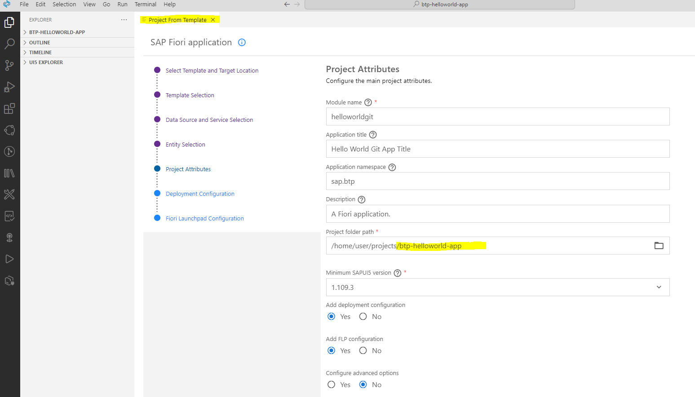

7. In the next step, Deployment Configuration choose Cloud Foundry as a target.
   Choose None for Destination name.
   Choose Add application to managed application router? Yes. This is the standard html5 repository from launchpad service and eases deployment.

8. The launchpad service needs some Fiori Launchpad Configuration data about the app (optional). 
   Choose names for the entries Semantic Object, Action, and Title (examples see figure)  
   Semantic Object: <code>helloworld </code> 
   Action: <code>show </code> 
   Title: <code>showhelloworld </code>  

9. Choose **Finish**.

11. After your App is generated, you should see in the Explorer the new folder **"helloworldgit"** (or helloworldui5 if you named it helloworldui5) under **BTP-HELLOWORLD-APP**.
**Note:** Everything is **"U"**, means untracked in BAS Git branch "main" and also not pushed to the remote Git repo.

    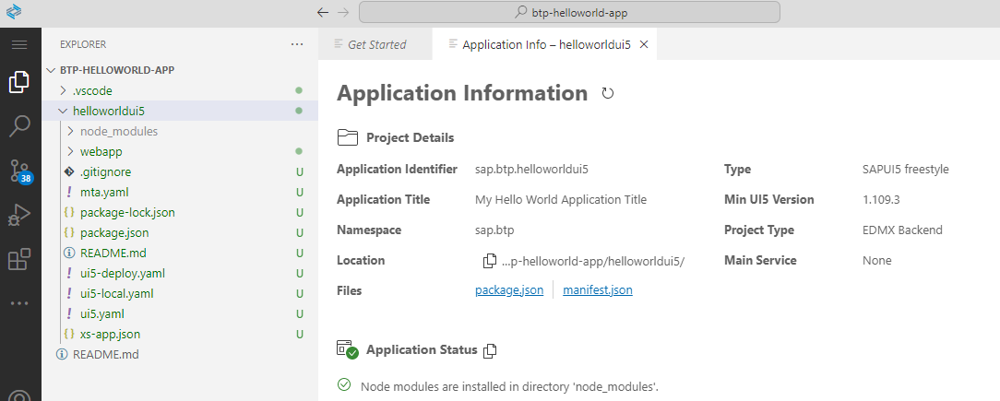

12. (Optional) You may also check everything in **GitLens** in BAS. 
    Click the small GitLens icon in the left-handed navigation pane and check your **Branches** and **Remotes**

    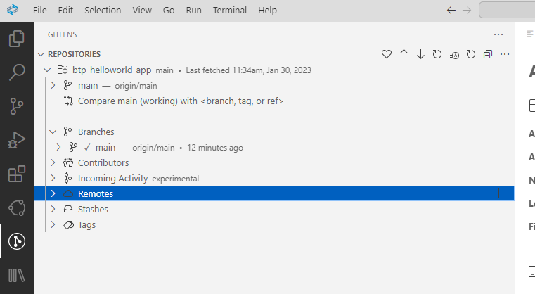

 
 

### Commit your Changes to Git and Push to your Remote Repository

1. Click on the smal **Git icon** in the left-handed navigation pane. your **Source Control** opens.
   Optional: Check all new or changed files.

2. Click on `Commit`.

    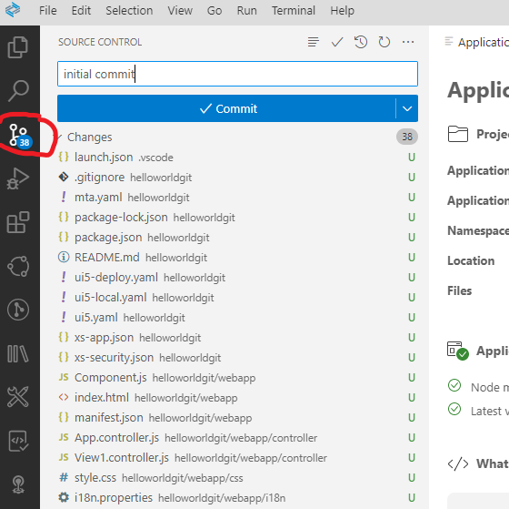
    
3. You will get a Warning, that you did not stage your changes to commit. This is a Git feature. You have to tell Git explicetely which files you want to commit.
   You just choose `Yes` or `Always` if you know want to commit all changes always.
   
   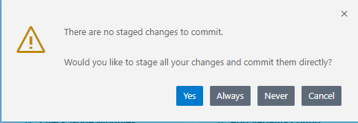
   
4. Your changes will be "commited" to your main branch. This does not mean, that you have already pushed your changes to your remote repo. 
You may check this and refresh your remote rep. Still empty:
   
   
   
5. Click on `Sync Changes`. This will push your changes to your remote repo.

    
    
6. You will get a warning again. Click **OK**.

    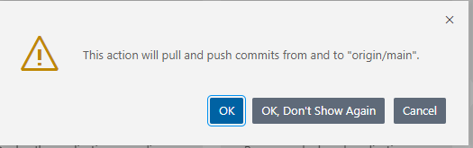
    
7. As a result your files will change from "Untracked" to tracked.    

 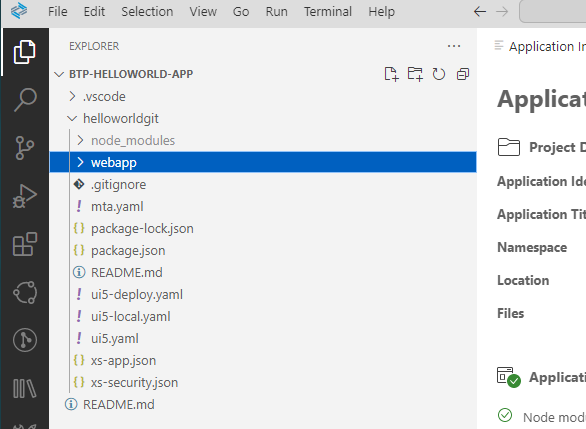

8. Check now also your remote repo. You see its filled with your project now.

 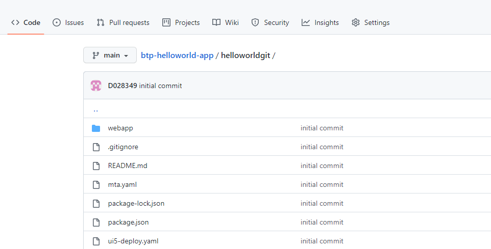
 
 
  
 

