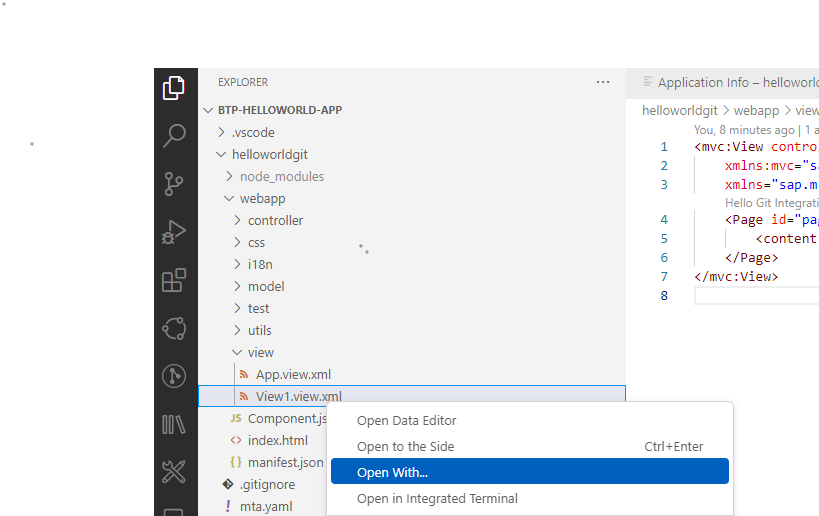
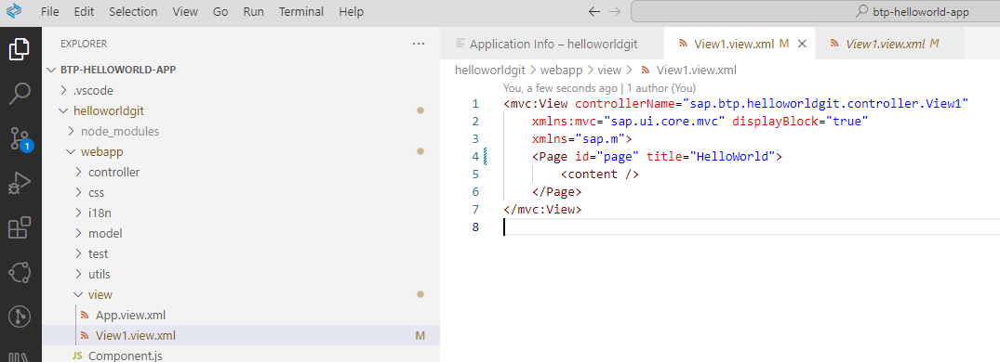
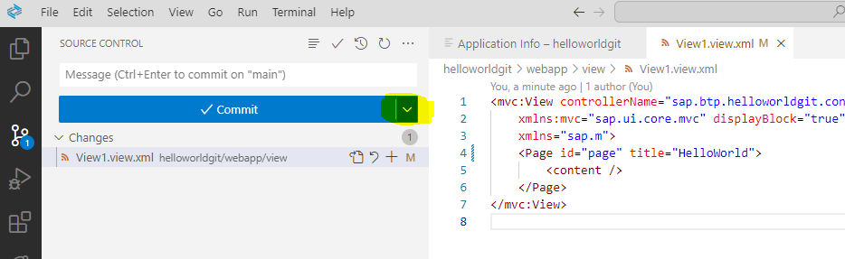

## Change your Git Project and Commit to your Remote Repository

In this section we want to change the existing Hello World project, track the changes, commit in Git, sync and push changes to the remote Git repo.

**Procedure**

1. Open your project in the **Menu (Bar)** from the file folder "/home/user/projects/btp-helloworld-app/helloworldgit" if not done so already.

2. Click on the left-handed icon **Explorer** and navigate to your view "View1".

    
    
3. Right-click on **View1** and choose **Open With**. 
   you have the option to use the either the **Text Editor** or the **Layout Editor**. Try both. 
   We will do the changes in the Text Editor, which is much easier for the small task.
   
4. Change the Page Title to **"Hello World"**. Using a static name will also increase the performance slightly.

    
    
5. Navigate back to your Source Control using the icon "Source Control".
   You will see you changes under `Changes`. 
   Switch also from "Commit" to "Commit&Push" by clicking the small dropdown icon next to the "Commit" button

   

