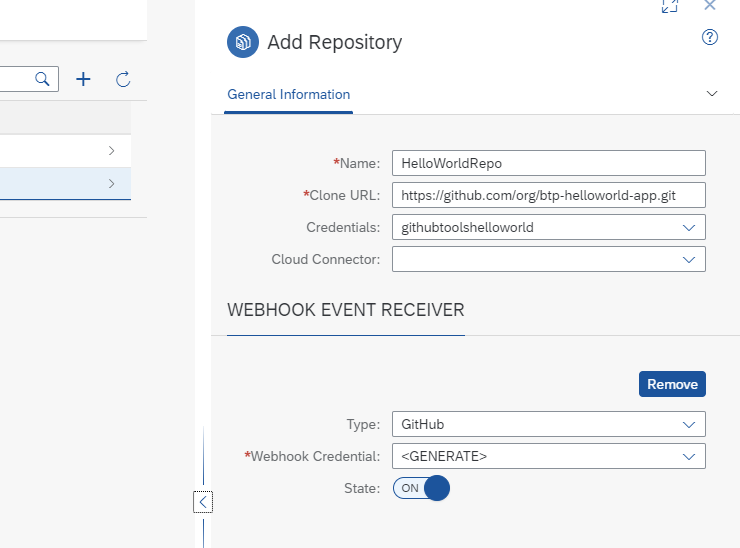
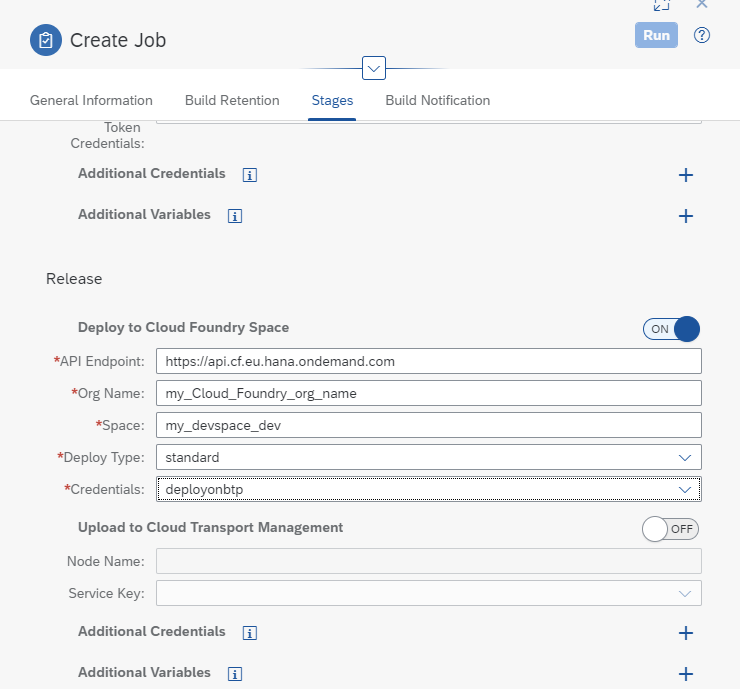
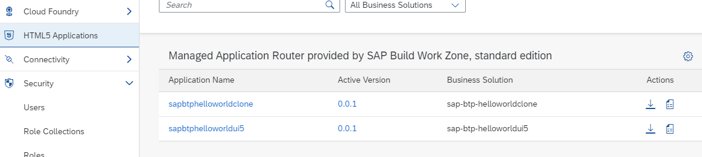

## Continuous Integration and Delivery (CI/CD)

SAP Continuous Integration and Delivery (CI/CD) is a service on SAP BTP, which lets you configure and run predefined continuous integration and delivery pipelines. 
It connects with your Git SCM repository and builds, tests, and deploys your code changes. 
In its user interface, you can easily monitor the status of your builds and detect errors as soon as possible, which helps you prevent integration problems before completing your development.

In this mission you will use GitHub.


### Enable SAP Continuous Integration and Delivery service

<details><summary>
Find your CI/CD service
</summary>
   
  

1. Go to your SAP BTP cockpit by using one of the following links, depending on the landscape you want to use: <br>
   Enterprise Account: https://cockpit.hanatrial.ondemand.com/ <br>
   Trial: https://cockpit.hanatrial.ondemand.com/

2. Enter your **Global Account**. (If you are using a trial account, choose Go To Your Trial Account).

3. Check your **Entitlements**. Choose **Entity Assignments** and check that you are entitled to use the BTP Service **Continuous Integration & Delivery (CI/CD)** in your subaccount. It is a "shared unit", so no quota assignment for your subaccount is required.

3. Choose **Account Explorer** in the left-hand navigation pane and choose your **Subaccount** in which you wnat to run CI/CD.

4. In your Subaccount, choose **Instances and Subscripions** and check if Continuous Integration & Delivery service is already subscribed. 
   This is the case, if you executed the booster in the previous section with the option to activate CI/CD.

</details>


<details><summary>
Activate CI/CD service
</summary>


1. If you did not already subscribe to the CI/CD service, choose **Service Marketplace** in the left-hand pane.

2. Type **Continuous Integration & Delivery** in the search box and choose the service tile. <br>
   For **Service Plan** choose	for an enterprise account **default** - Subscription (enterprise) or for a trial account choose **Subscription (trial)**.

3. Choose Create.

4. Choose Create in the popup without changing any values. Wait until the status changes to **Subscribed**.

5. From the left-handed cockpit navigation pane, choose **Security** and then **Security → Users**.
6. Select your user. A detail screen for the user will open right-handed.
7. In the detail screen, scroll to **"Role Collections** and click **Assign Role Collection**.

8. From the dropdown list, select **CICD Service Administrator** and **CICD Service Developer** and confirm your choice with Assign Role Collection.

</details>

<details><summary>
Access Continuous Integration and Delivery Service
</summary>


1. In your SAP BTP subaccount, navigate to Services → Instances and Subscriptions in the left-hand pane.

2. Choose the Go to Application icon located next to the Continuous Integration & Delivery subscription.

   

3. Use your credentials to log in to the application if required.

4. You will see an empty Continuous Integration and Delivery service. <br>
   You will create in this tutorial 2 Jobs for 2 remote repositories. <br>

   

<br>

</details>

### Configure your CI/CD Service

<details><summary>
   Create Credentials for Accessing GitHub and BTP
</summary>


1. Choose **Credentials** on the top-level navigation.

2. Click in the "+" icon, **Create Credential**.

3. Create Credentials for accessing the GitHub repo. <br>
   Credentials Name: any <br>
   Username: your Github password <br>
   Password: your Github password. You may use your Personal Access Token, you created in the Git Tutorial. <br>

   

4. Create Credentials for accessing the BTP platform, which will be needed to deploy the build archive. <br>
   Provide a name for th entry, e.g. "deployonbtp. <br>
   Choose Authentication Type, e.g. Basic Authetication <br>
   Provide the user and password for a user which has the assigned role collection for CI/CD usage. <br>
   For productive usage consider to create and use a technical user.
<br>
   
</details>


<details><summary>
Create an CI/CD Entry for your GitHub Repository
</summary>

1. Click on "Repositories" in the top-level navigation.

2. Click in the "+" icon, **Add repository**.

7. Provide the required infromation, e.g.: <br>
   Name: e.g. HelloWorldRepo <br>
   Clone URL: your GitHub Repo URL which contains the **helloworldui5** project from the previous section. <br>
   Credentials: the one we just defined <br>
   
   Generate a **WebHook Event Receiver**: Choose "Generate" <br>

   

8. Check the generated Webhook Data. Click on Webhook Data. <br> 
   You will need this Data for your GitHub Repository and the CI/CD pipeline.
   
   

   <br>
   </details>


<details><summary>
   Create the Webhook Credentials for the CI/CD pipeline
</summary>


1. Click on Credentials again, choose "+" Add Credentials again.

2. Provide the data, using the secret from your repository definition.  

   
  
<br>  
   
   </details>

<details><summary>
   Create the Webhook in your GitHub Repository
</summary>


1. Open your GitHub Repository, which contains your **helloworldui5 project** from the previous section.

2. Click on **Settings** and then on **Hooks**.

   

3. Click on **Add Webhook**. <br>
   Copy Payload URL and Secret from your generated Webhook Data from your CI/CD repository definition. <br>
   SSL verification will be auto enabled.

   

4. Click on **Add Webhook** and check the result. <br>

<br>  
   </details>

### Create a Job with your CI/CD Service Job Editor

<details><summary>
Create a Job
   </summary>

1. Click on **Jobs** in the CI/CD service. Choose `"+"` **Create Job**.

2. Provide the **General Information**: <br>
   Job Name: Any <br>
   Repository: The one you just defined. <br> <br>
   Branch: **main**  (typically main, if you did not change it) <br>
   Pipeline: **SAP Fiori in the Cloud** (this is a predefined pipeline) <br>
   
3.  **STAGES** <br>
   Configuration Mode: **Job Editor**  <br>
   Build Tool Version: Java 11 Node 16 <br> 
   Choosing Job Editor means, you will use a form to provide the necessary pipeline data not a .pipeline/config.yml file. <br>
    
   
 
4. **Skip some Stages**  <br>
   **Switch `OFF`** the following stages, because it is not part of a beginner tutorial.    <br>
 
     * Addition Unit Tests <br>
     * Malware Scan <br>
     * Compliance <br>


5. Switch **`ON`** your **Release** Stage. <br>
   Provide the deployment information to your Cloud Foundry Space. <br>
   
   **API Endpoint:** copy from your Subaccount "Overview" page  <br>
   **Org Name:** copy from your Subaccount "Overview" page  <br>
   **Space:** copy from your Subaccount "Overview" page  <br>
   **Deploy Type:** standard <br>
   **Credentials:** deployonbtp or how you named it. <br>

   

<br>

6. Clicke **`Create`**.

7. Click **`Run`**. <br>
   Build and deployment will take some minutes.  <br>
   You can see the log of the build process during execution of the buld pipeline. <br>
   If everything is ok, you will get a green result log <br>
   
      
      
   <br>

8. Congratulations! If the Release Stage is also green, your Job has been deployed. <br>
   Check the result in your Subaccount **HTML5 Applications** : <br>
   (Note: You can create the "helloworldclone" app in a different tutorial)
   
      
   
   <br>
</details>


<details><summary>
   Hints, Tips and Troubleshooting
</summary>


This tutorial works only if you dont have subfolders in your Git repository. 
Because the Job Editor of CI/CD does not support configuring subfolders. 
You can solve this using a pipeline definition with configuration.yml file. 

Check the Quota of your Cloud Foundry Runtime in your Subaccount. 
If you dont have enough free Quota, the release stage of CI/CD service will fail, as well as manual deployment. 
For example, if you want to deploy 2 HTML5 apps deployed, you need 2 units of Cloud Foundry Runtime as quota in your Subaccount.
See also this [SAP Blog](https://blogs.sap.com/2022/02/11/optimise-your-sap-btp-cloud-foundry-runtime-costs/).
</details>

### Create a Job with .pipeline/config.yml


<details><summary>
Use a config file instead of Job Editor   
</summary>

If you use subfolders in your Fiori project you have to use **.pipeline/config.yml** pipeline definition in your Git repository. <br>
You can create one from your Job Editor definitions. <br>
Click on the small **`YML icon`** in your Job definition and an editor will open, containing your job defition as yaml-file.

      
      
If you subfolder is for example **helloworldclone**, you have to add in your "Build Stage"   **source: helloworldclone**. E.g.:
````
stages:
  Build:
    source: helloworldclone
    npmExecuteLint: false
````

The whole config.yml could look like this:

```
---
general:
  buildTool: "mta"
service:
  buildToolVersion: "MBTJ11N16"
stages:
  Build:
    source: helloworldclone
    npmExecuteLint: false
  Additional Unit Tests:
    npmExecuteScripts: false
  Malware Scan:
    malwareExecuteScan: true
  Acceptance:
    cloudFoundryDeploy: false
    npmExecuteEndToEndTests: false
  Compliance:
    sonarExecuteScan: false
  Release:
    cloudFoundryDeploy: true
    cfApiEndpoint: "https://api.cf.eu10.hana.ondemand.com"
    cfOrg: "mysubdomain"
    cfSpace: "dev"
    cfCredentialsId: "deployonbtpcredentials"
    deployType: "standard"
    tmsUpload: false
steps:
  artifactPrepareVersion:
    versioningType: "cloud_noTag"
  cloudFoundryDeploy:
    mtaDeployParameters: "-f --version-rule ALL"
```

You have to cretae in the root of your GitHub Repository the folder and file **.pipeline/config.yml** and provide the configurations.
Switch the **Configruation Mode** of your Job to **Source Repository** and **Run**.

<br>
   
</details>


<details><summary>Further information
</summary> 

SAP Help Portal: [Continuous Integration and Delivery](https://help.sap.com/docs/CONTINUOUS_DELIVERY?locale=en-US)

SAP Help Portal: [Continuous Integration and Delivery by SAP](https://help.sap.com/docs/CICD_OVERVIEW)
</details>
